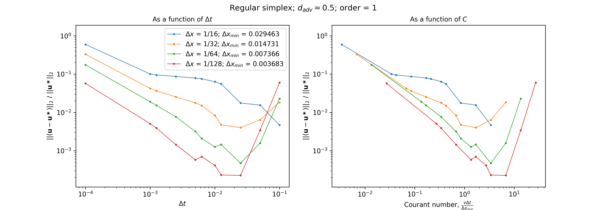
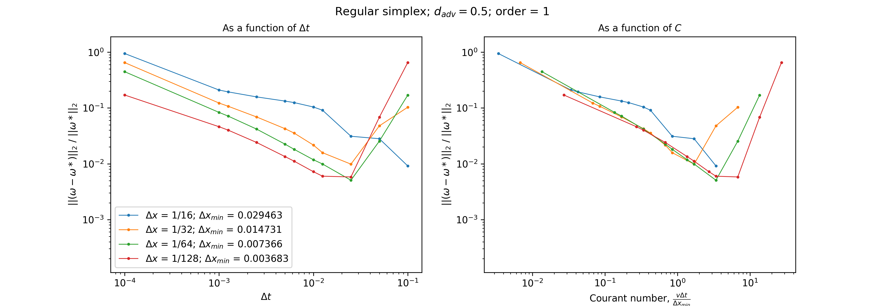

# uw3-advection-tests

## Current results 

Test scenario: 
Vector field (rigid body with Gaussian envelope) travels a total distance of 0.5. 
Velocity is uniform throughout the domain with v = (1.0, 0.0).

I. Relative norm of the velocity as a function of time step, $\Delta t$, and Courant number, C: 

II. Relative norm of the vorticity, $\omega$, as a function of time step, $\Delta t$, and Courant number, C: 

