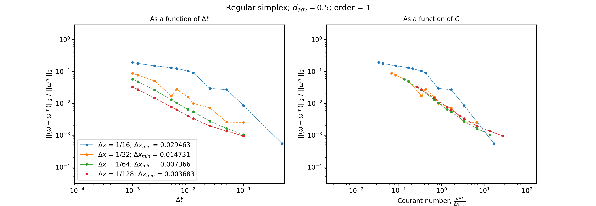

# uw3-advection-tests

## Latest results (02/10/2024)

Test scenario: 
Vector field (rigid body with Gaussian envelope) travels a total distance of 0.5. 
Velocity is uniform throughout the domain with v = (1.0, 0.0). 
In all the plots below, solid lines indicate the old results while the dashed lines are the new ones. 

### A. Regular simplex mesh
A.1. Relative norm of the velocity as a function of time step, $\Delta t$, and Courant number, C: 

A.2. Relative norm of the vorticity, $\omega$, as a function of time step, $\Delta t$, and Courant number, C: 

### B. Irregular simplex mesh
B.1. Relative norm of the velocity as a function of time step, $\Delta t$, and Courant number, C: 

B.2. Relative norm of the vorticity, $\omega$, as a function of time step, $\Delta t$, and Courant number, C: 

### C. Structured quadrilatetral mesh
C.1. Relative norm of the velocity as a function of time step, $\Delta t$, and Courant number, C: 

C.2. Relative norm of the vorticity, $\omega$, as a function of time step, $\Delta t$, and Courant number, C: 

